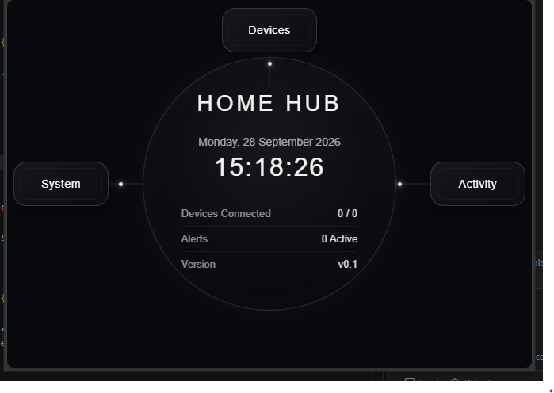

# Home Hub Prototype Testing

This document records deployment and hardware testing carried out during development of ShepByte Home Hub.

## V0.1 Hardware Deployment Test

**Status:** PASS  
**Date:** 28 September 2026

### Test Hardware

- Raspberry Pi 2 Model B v1.1
- 64 GB microSD card
- Raspberry Pi OS Lite 32-bit
- Connected to local network
- Headless access via SSH

### Software Environment

- Raspberry Pi OS 13 (Trixie)
- Python 3.13.5
- Git
- Home Hub repository cloned from GitHub

### Test

The Home Hub V0.1 frontend prototype was served from the Raspberry Pi using a temporary Python HTTP server.

The dashboard was accessed successfully from:

- Windows development PC
- Mobile phone
- Multiple devices over the local network

### Result

PASS

The test confirmed the basic deployment path:

Development PC → GitHub → Raspberry Pi → Local Network → Browser

The mobile interface currently requires responsive layout improvements.

### Next Milestone

Replace the temporary development HTTP server with the Home Hub backend/API and begin providing live system data to the frontend.

### Screenshot

Home Hub V0.1 running from the Raspberry Pi and accessed over the local network.

